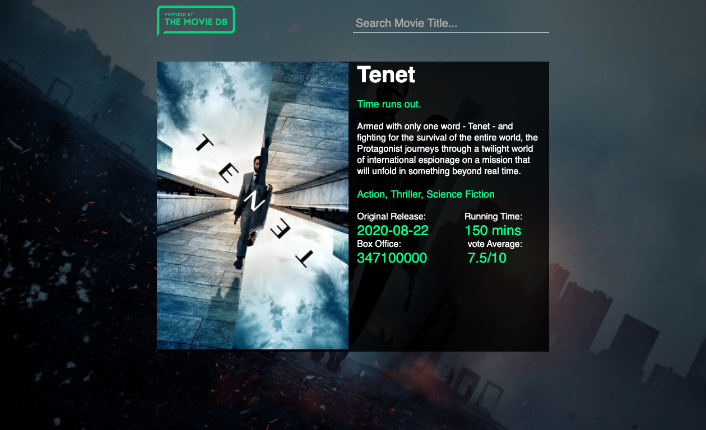
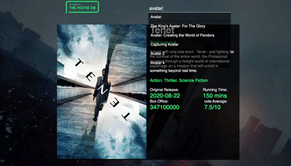

<h1 align="center">TMDB MOVIE SEARCH</h1>
<h2 align="center">

</h2>

<p align="center">
  


</p>



<h2 align="center"><a  href="https://aneudy-movie-app.netlify.app//">Live Demo</a></h2>

### [Contributions are Welcome](https://github.com/aneudya4/movie-app.git)

## Description

<p align="center">
</p>
TMDb Movie Search is a responsive React app that utilises React with with hooks, and CSS3 loading data via The Movie Database (TMDb) API.
I'm currently attending a  web development bootcamp and doing some independent learning as well.

## How to Search

- **START** Type movie name into input box
- **choose and submit** Select the answer by clicking it.

## Project setup:

```bash
git clone https://github.com/aneudya4/movie-app.git
cd movie-app
npm install
npm  start
```
